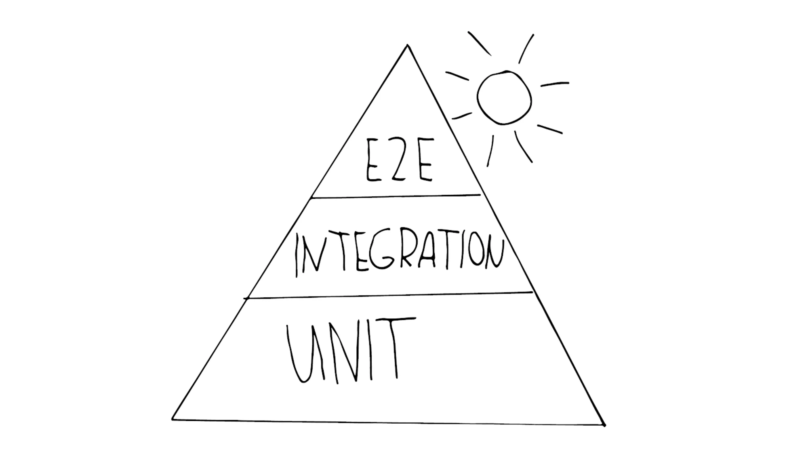
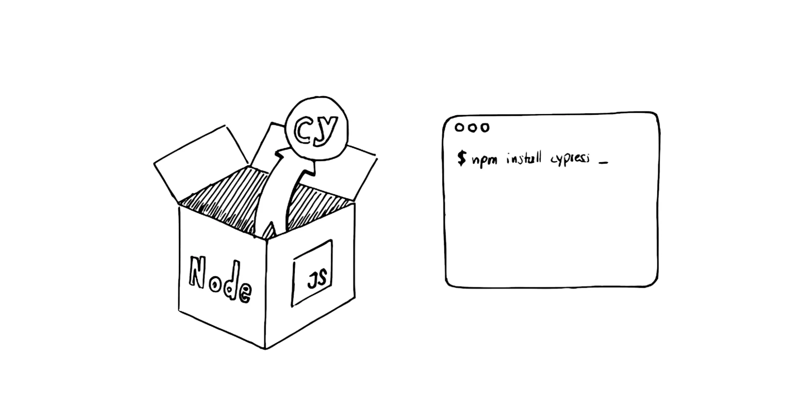

# Bimtime End-to-End Testing with Cypress 

a repository contains automated test suites for sablono web application to reduce the manual effort for end-to-end testing.
# Table of Contents

- [E2E Testing](#E2E Testing)
    - [The Importance of (Test) Automation](#sablono-account-management)
    - [The Testing Pyramid](#sablono-account-management)
    - [Why Cypress](#folder-structure)
    - [Folder Structure](#run-the-repository-code)
    - [How to start](#linting-and-formatting)
    - [Run a Test](#testing)
    - [Build for Production](#build-for-production)

# E2E Testing


### The Importance of (Test) Automation
Imagine the situation where you have to do manual regression testing for most of the test cases every day and also challenging to maintaining deadlines. There test automation plays a vital part in software development and testing that helps to reduce the time and cost associated with manual testing, while also increasing the accuracy and reliability of the tests. 

### The Test Pyramid
Testing pyramid consists of three layers that your test suite should consist of (bottom to top):

* Unit Tests
* Integration Test
* End-to-End Test




### Why Cypress
[Cypress](https://docs.cypress.io/guides/overview/why-cypress)  is a next generation front end testing tool built for the modern that is used by developers or QA engineers building web applications using modern JavaScript frameworks. 
Cypress enables to write all types of tests:

* End-to-end tests
* Component tests
* Integration tests
* Unit tests




### Folder Structure

Breakdown of notable folders and their contents:

<pre>
<b>cypress-testing-bimtime/</b>
├─<b>cypress/</b>
│ ├─<b>fixtures/</b>: Find fixed test data here, which have no relation to the other entities.
│ ├─<b>integration/</b>: Find the actual tests here.
│ ├─<b>plugins/</b>: Here extended cypress, whether with existing Cypress plugins or your own.
│ ├─<b>Support/</b> Here extend Cypress itself. Your own commands and helpers are located here.
│ ├─<b>images/</b>
│ │ ├─<b>localImages/</b>: images used in markdown file.
├─<b>cypress.config.js/</b> Modify configurations here, including for the environment.
</pre>

### How to Start 

If your system do not have 
   ```shell
   npm install -g npm
   ```
 ```shell
   brew install node
   ```
 ```shell
  git clone https://github.com/sb-lubnayaqoob/cypress-bimtime-testing
   ```

### Run the Repository Code

  Install dependencies

   ```shell
   npm install
   ```


## Build for Production

Building any web client app is done with the `nx build` command followed by the name of the app, e.g. `sb-account-mgmt`.

```shell
nx build <app name>
```
