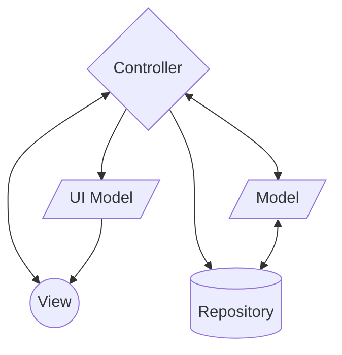

# Bimtime End-to-End Testing with Cypress 

Monorepo containing end-to-end automating testing 

# Table of Contents

- [E2E Testing](#E2E-Testing)
    - [The Importance of (Test) Automation](#The Importance of (Test) Automation)
        - [App Architecture](#app-architecture)
        - [Folder Structure](#folder-structure)
- [Shared Components](#shared-components)
- [Development](#development)
    - [Run the Repository Code](#run-the-repository-code)
    - [Linting and Formatting](#linting-and-formatting)
    - [Testing](#testing)
    - [Build for Production](#build-for-production)

# E2E-Testing


## The Importance of (Test) Automation
Test automation is an important part of software development and testing that helps to reduce the time and cost associated with manual testing, while also increasing the accuracy and reliability of the tests. 

### The Test Pyramid
Testing pyramid consists of three layers that your test suite should consist of (bottom to top):


* Unit Tests
* Integration Test
* End-to-End Test


### Dataflow



### Responsibilities

#### View

React component representing the UI. This component contains any code for displaying the interface that a user interacts with. The _*View*_ is "dumb" and only used for user input and for displaying output.

#### Controller

React component for handling all _*View*_ related logic. The _*Controller*_ is the "brains" of the _*View*_, it processes any data or events coming from the _*View*_ and manages the state of the _*View*_.

The _*Controller*_ might map complex data structures to a _*UI Model*_ before passing the data for display in the _*View*_. Similarly, the _*Controller*_ might also communicate with the _*Repositories*_ by mapping data to a relevant _*Model*_ and passing it to a _*Repository*_.

#### UI Model

A class holding data meant for a _*View*_. A _*UI Model*_ can be reused for any _*View*_ and may contain methods for performing various operations on the _*UI Model*_ data.

#### Model

A class that works as a `Data Transfer Object (DTO)` for encapsulating data from and to the _*Repositories*_.

Instead of passing on all the response data from an API call to the application the _*Model*_ is composed of only the relevant response values.

#### Repository

The _*Repositories*_ functions as wrappers around the Sablono Platform API where any interactions with the Sablono Platform API is done via a _*Repository*_.

Data coming from a _*Repository*_ is mapped to a _*Model*_ while data can be passed to a _*Repository*_ either as single parameters or as a _*Model*_ depending on complexity.

### Folder Structure

Breakdown of notable folders and their contents:

<pre>
<b>sb-account-mgmt/</b>
├─<b>src/</b>
│ ├─<b>contexts/</b>: Various React contexts used for sharing state across components.
│ ├─<b>hooks/</b>: Various React hooks for reusing functionality that depends on React specific features.
│ ├─<b>models/</b>: Classes to which Sablono Platform API data gets mapped.
│ ├─<b>repositories/</b>
│ │ ├─<b>api/</b>: Constants for the Sablono Platform API resources.
│ │ ├─<b>mappers/</b>: Mappers for mapping API data to models.
│ │ └─<b><em>repository-name/</em></b>: Wrappers for Sablono API endpoints.
│ ├─<b>ui-models/</b>: Classes with data used in <em>Controllers</em> and <em>Views</em>.
└-└─<b>views/</b>: React components for <em>Views</em> and their logic.
    └─<b><em>ComponentName/</em></b>
      ├─<b><em>ComponentName</em>Controller.tsx</b>: Component containing the <em>View</em> related logic.
      └─<b><em>ComponentName</em>View.tsx</b>: "Dumb" component containing the UI representation.
</pre>

# Shared Components

`Nx Monorepo` allows for sharing components across applications. These components are located in the `libs` directory. Any component that will be copied and reused in more than one project could be considered as a `lib`.

# Development

## Run the Repository Code

1. Install the NX CLI if it is not already available.

   ```shell
   npm install -g nx
   ```

2. Install dependencies

   ```shell
   npm install
   ```

3. Run Web Client Apps

   Running any web client app is done with the `nx serve` command followed by the name of the app, e.g. `sb-account-mgmt`.

   ```shell
   nx serve <app name>
   ```

## Linting and Formatting

The code base can be formatted with Prettier to adhere to the ESLint rules by running:

```shell
nx format:write
```

## Testing

Testing a specific web client app is done with the name of the app followed by the test command, e.g. `sb-account-mgmt:test`.

```shell
nx run <app name>:test
```

Testing all web client apps is done by running:

```shell
nx test
```

## Build for Production

Building any web client app is done with the `nx build` command followed by the name of the app, e.g. `sb-account-mgmt`.

```shell
nx build <app name>
```
